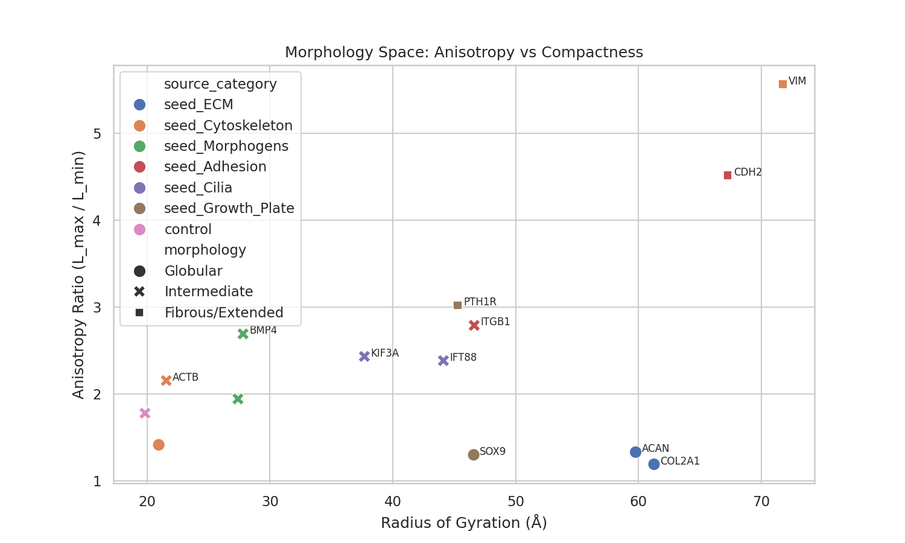
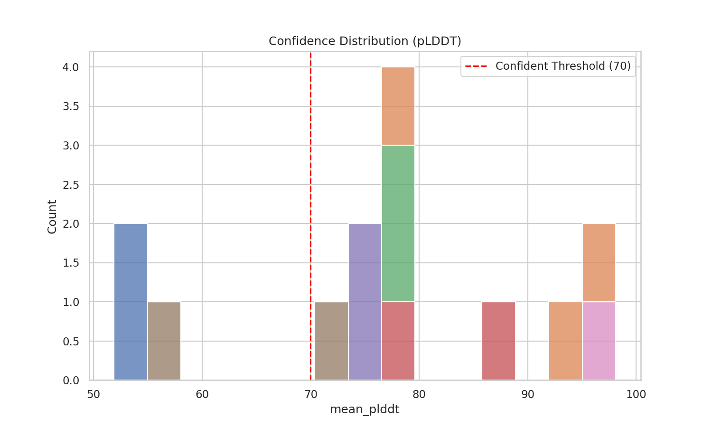

# AlphaFold Counter-Curvature Analysis Report

**Date:** 2026-01-03
**Proteins Analyzed:** 14

## 1. Scientific Framework
This pipeline explores the "Biological Countercurvature of Spacetime" hypothesis by identifying structural proteins that may contribute to axial mechanical robustness.
While gravity is negligible at the molecular scale, we assume that organism-level loads select for specific protein architectures (fibrous, anisotropic, stiff) in load-bearing tissues.

## 2. Methodology
- **Selection:** based on discreation/rank/score (HOX/PAX seeds).
- **Data Source:** AlphaFold Protein Structure Database (Official API).
- **Metrics:** Anisotropy (Principal Moments of Inertia), Radius of Gyration, pLDDT Confidence.

## 3. Key Findings

### Morphology Landscape
The plot below maps proteins based on their extension (Anisotropy) vs size (Rg).
High anisotropy indicates fibrous/extended potential.

### Top Anisotropic Candidates (Fibrous Potential)
| Gene | Anisotropy | Rg (Å) | pLDDT | Morphology |
|------|------------|--------|-------|------------|
| VIM | 5.57 | 71.7 | 77.1 | Fibrous/Extended |
| CDH2 | 4.52 | 67.3 | 79.4 | Fibrous/Extended |
| PTH1R | 3.02 | 45.3 | 71.0 | Fibrous/Extended |
| ITGB1 | 2.79 | 46.6 | 85.9 | Intermediate |
| BMP4 | 2.69 | 27.8 | 78.5 | Intermediate |

### Confidence Overview
Distribution of model confidence. High pLDDT (>70) suggests well-ordered domains.

## 4. Testable Predictions
Based on these metrics, we predict:
1. **High Anisotropy Candidates:** Proteins like VIM, CDH2, PTH1R likely form extended cytoskeletal or ECM networks essential for resisting compression.
2. **Compact/Globular Candidates:** Proteins with low anisotropy likely function as soluble regulators or globular domains.

## 5. Next Steps
- Validate extended candidates in vivo (staining/KO).
- Expand search using the 'Expansion Modules' in `targets.yaml`.
- Correlate with tissue stiffness data.
